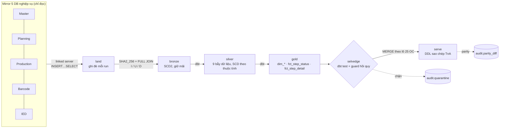

# Loomline

**Loomline — snapshot-diff SCD pipeline for garment production tracking, on Airflow, dbt, SQL Server and Kubernetes.**

*loom* = khung dệt, *line* = đường ống dữ liệu. Cổng chất lượng trước khi dữ liệu ra ngoài tên là **selvedge** (mép biên vải).

> 🚧 Dự án cá nhân 4 tuần (14/09 → 11/10/2026) để luyện Data Engineering trên dữ liệu thật của một nhà máy dệt may. Đang ở **tuần 0 · chuẩn bị**. Tiến độ: [GitHub Project](https://github.com/users/DuyNe07/projects/4) · [Milestones](https://github.com/DuyNe07/Loomline/milestones) · Tài liệu: [Wiki](https://github.com/DuyNe07/Loomline/wiki)

## Bài toán

Nhà máy theo dõi tiến độ mỗi đơn hàng qua 23 bước **Sợi → Đan → Nhuộm → May** (TnA, Time and Action). Mốc thực tế của từng bước hiện được suy ra bởi 18 builder C# chạy theo round (Quartz + RabbitMQ), đọc thẳng từ các service nguồn. Các nguồn này **update tại chỗ, xoá cứng, không có CDC/rowversion, và `ModifiedDate` không đáng tin** — nên lịch sử trạng thái mất ngay ở nguồn và mọi phép "chỉ lấy dòng mới" đều bỏ sót.

Loomline thay luồng đó bằng ELT tiêu chuẩn: chụp trọn bảng nguồn mỗi lần chạy, nhận diện thay đổi bằng **diff hash theo khoá tự nhiên**, giữ lịch sử **SCD Type 2** ở bronze, rồi port luật nghiệp vụ sang **dbt** trên nền dữ liệu có lịch sử, và đo **parity** với hệ thống đang chạy.

## Kiến trúc



| Tầng | Vai trò | Kỹ thuật chính |
|---|---|---|
| land | Bản chụp nguyên trạng của 22 bảng (≈3,68 triệu dòng) | `TRUNCATE + INSERT … SELECT` qua linked server, scope theo OC |
| bronze | Sổ cái lịch sử duy nhất | hash SHA2_256 trên cột nghiệp vụ, dedupe khoá, `_op` S/I/U/D, op D chỉ trong scope, 4 ràng buộc SCD |
| silver | Làm sạch, chuẩn hoá, xử lý 9 bẫy dữ liệu một lần | dbt view/table/snapshot; Type 1, 3 (tính lại), 4 (dẫn xuất), 2 (dbt snapshot) |
| gold | Mô hình sao theo luật từng bước | accumulating snapshot + periodic snapshot + transaction fact |
| serve | Đích đo parity | MERGE trong transaction, không bao giờ chạm cột người dùng nhập |

**Ba luồng, một bộ code** (tham số `run_mode`): `init` (chụp mốc, op S), `daily` 22:00 (cửa sổ giao hàng −90…+180 ngày), `backfill` @monthly từ 2025-01 cho câu hỏi BA về lead time và tỉ lệ trễ.

## Stack

| Mảng | Công cụ |
|---|---|
| Kho | SQL Server 2022 Developer (StatefulSet), DB `LoomlineDW`, 7 schema |
| Điều phối | Apache Airflow 3 (Helm chính thức, CeleryExecutor, Asset + `run_registry`, sensor deferrable) |
| Biến đổi | dbt-core 1.9 + dbt-sqlserver qua astronomer-cosmos |
| Hạ tầng | Kubernetes của Docker Desktop (WSL2), KEDA scale worker 1 → 8 |
| CI/CD | GitHub Actions (lint, DAG integrity, diff unit test trên mssql container, dbt unit test) → GHCR → git-sync + Argo CD |

## Lộ trình

| Tuần | Milestone | Chạy được vào Chủ nhật | Tag |
|---|---|---|---|
| 0 · 09–13/09 | Chuẩn bị | `kubectl get nodes` Ready, login read-only, `tables.yaml` | — |
| 1 · 14–20/09 | Nền k8s + Bronze SCD2 | Diff chạy 2 lần: 1 U / 1 D / 1 I rồi 0 thay đổi | v0.1.0 |
| 2 · 21–27/09 | dbt silver/gold + parity | Step Đan (2) và May (15–20), parity ≥ 95% trên 766 OC | v0.2.0 |
| 3 · 28/09–04/10 | Ba luồng + selvedge + CI/CD | Daily 3 đêm liên tiếp, backfill 18 tháng, merge → pod mới < 10 phút | v0.3.0 |
| 4 · 05–11/10 | Scale ×20 + kể chuyện | 20 triệu dòng land + diff < 15 phút, KEDA scale | v0.4.0 |

Nhuộm (step 7–10, routing BOM) là phần thưởng tuần 4. Các bước cần gateway ERP là phase 2.

## Số đo

| Chỉ số | Mốc so sánh | Loomline |
|---|---|---|
| Đồng bộ trọn tập đơn đang theo dõi | ≈24 phút (hệ thống .NET, 766 OC) | _điền tuần 3_ |
| Land + diff 22 bảng | — | _điền tuần 1_ |
| Parity step 2, 15–20 | mục tiêu ≥ 95% | _điền tuần 2_ |
| Land + diff ×20 (≈20 triệu dòng) | mục tiêu < 15 phút | _điền tuần 4_ |

Chi tiết trước/sau từng đòn bẩy sẽ nằm ở `docs/measurements/`.

## Cấu trúc repo (dự kiến)

```text
dags/            DAG land, orders, steps_*, publish, init, backfill; common/ (registry, assets, modes)
sql/ddl/         schema land, bronze, audit, serve, load
sql/bronze/      diff_template.sql.j2 + tables.yaml (khoá, cột hash, cột OC scope)
sql/publish/     guard hồi quy, MERGE step, thay detail
dbt/             models/{staging,silver,gold}, snapshots, seeds, tests, unit_tests
tests/           DAG integrity, diff I/U/D, parity
gitops/          Helm values Airflow, Argo CD Application, KEDA, mssql
docker/          image Airflow + dbt + msodbcsql18 + cosmos
docs/            adr/, measurements/, runbook.md
tools/           github-bootstrap (dựng Project, wiki, nhánh)
```

## Nhánh

`w{n}/<việc>` → **`dev`** (squash) → **`uat`** (merge commit, được bảo vệ: bắt buộc PR, cấm force-push) → **`main`** (merge commit + tag cuối tuần). Chi tiết và lý do: [Quy trình nhánh và PR](https://github.com/DuyNe07/Loomline/wiki/Quy-trinh-nhanh-va-PR).

## Tài liệu

| Chủ đề | Wiki |
|---|---|
| 23 bước TnA, luật start/complete, 9 bẫy dữ liệu | [Nghiệp vụ](https://github.com/DuyNe07/Loomline/wiki/Nghiep-vu-1-Boi-canh-TnA) · [23 bước](https://github.com/DuyNe07/Loomline/wiki/Mapping-5-Step-Rules) |
| Mapping cột bronze → silver → gold → serve | [Xuyên tầng](https://github.com/DuyNe07/Loomline/wiki/Mapping-0-Xuyen-tang) |
| Kiến trúc, hạ tầng, CI/CD, scale | [Kỹ thuật](https://github.com/DuyNe07/Loomline/wiki/Ky-thuat-1-Tong-quan) |
| Kế hoạch, DoD, rủi ro | [Kế hoạch](https://github.com/DuyNe07/Loomline/wiki/Ke-hoach-Timeline-DoD) |

## Dữ liệu và an toàn

- Lab chỉ **đọc** bản mirror qua login read-only; mọi thứ ghi ra nằm trong `LoomlineDW` của cụm local. Không ghi vào bất kỳ DB nào của công ty.
- Không credential trong Git: secret tạo tay trong Kubernetes Secret, đọc qua biến môi trường; pre-commit `detect-secrets`.
- Repo và wiki công khai có chủ đích; repo không chứa dữ liệu nguồn. Fixture test được mask (tên khách, mã đơn, số lượng); tài liệu công khai đã thay IP và mã định danh bằng ký hiệu (`<OC-A>`, `<lab-host>`).
